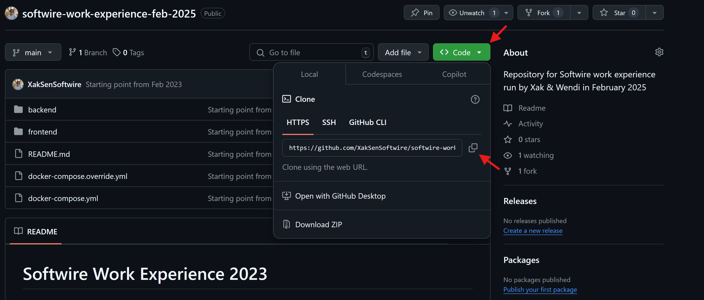

# Softwire Work Experience 2025

## General Setup
<!-- 1. Connect to the 'Softwire Guest' network
2. Locate the [GitHub repository](https://github.com/XakSenSoftwire/softwire-work-experience-feb-2025) & these `readme` setup instructions -->
1. Sign into your/create a new [GitHub](https://github.com/signup) account 
2. Sign into your/create a new [Trello](https://id.atlassian.com/signup?application=trello&continue=https%3A%2F%2Ftrello.com%2Fauth%2Fatlassian%2Fcallback%3FreturnUrl%3D%252F%26display%3DeyJ2ZXJpZmljYXRpb25TdHJhdGVneSI6InNvZnQifQ%253D%253D%26aaOnboarding%3D%26updateEmail%3D%26traceId%3D%26ssoVerified%3D%26createMember%3Dtrue%26jiraInviteLink%3D&display=eyJ2ZXJpZmljYXRpb25TdHJhdGVneSI6InNvZnQifQ%3D%3D) account
3. Here is the [Trello board](https://trello.com/invite/b/67ab6afb59b643271d16d90a/ATTIea18b0eacececb17b89dca60b2976d4dDB9CD017/softwire-work-exp-feb-2025). We will be using this to manage the progress of your project - make sure you have access to view it.
4. Connect [Vercel](https://vercel.com/login) to your GitHub.
5. Check you can view [this deployed site](https://softwire-work-experience-feb-2025-opal.vercel.app/). It should be a blank site with `Hello World!` written in black text in the top left.
6. Install your preferred IDE (integrated development environment) - I recommend [VSCode](https://code.visualstudio.com/download)
7. Install [Git](https://git-scm.com/downloads/win)
<!-- TODO: WRITE DOCKER INSTALLATION -->
8. Install docker by following [these installation instructions]()
9. **[Optional]** Install your preferred search engine (e.g. Chrome, Firefox)

> Don't be scared to ask Xak or Wendi for help :)

## Cloning a repo
1. Open your IDE terminal
2. Navigate to your local documents folder using the commands `ls` to list the possible paths to follow and `cd <PATH NAME>` to choose a path to follow. 
3. Find the repository web URL as shown in the image below: `GitHub repository > Code > Copy url to clipboard`.

4. Run `git clone <REPO WEB URL>` in the terminal. This will create a local copy of the codebase for your development purposes.
5. Open the project folder by following `File > Open Folder`in your IDE

The repositories you will need to clone this week are:
- [The Tetris Project](https://github.com/XakSenSoftwire/softwire-work-experience-feb-2025)
<!-- TODO: UPDATE THESE LINKS -->
- [The Intro to JS]() 
- [The Intro to HTML/CSS]()

## Running Tetris Locally
1. Navigate to the root of the repository in the CLI.
2. Run the command `$ docker-compose up` in the terminal to start all 3 services (frontend, backend, database)
3. Check you have access to the frontend by navigating to `http://localhost:8080/pages/index.html` in your browser

TIP: *Pressing CTRL+C in the terminal sends a signal to stop whatever application is currently running*

If you would like control of your terminal instead, run `$ docker-compose up -d` to run them in the background. Make sure to run `$ docker-compose down` when you want them to stop

You should now be able to access these services using a web browser. Just visit:

 - `localhost:8080` for the frontend
 - `localhost:3000` for the backend
